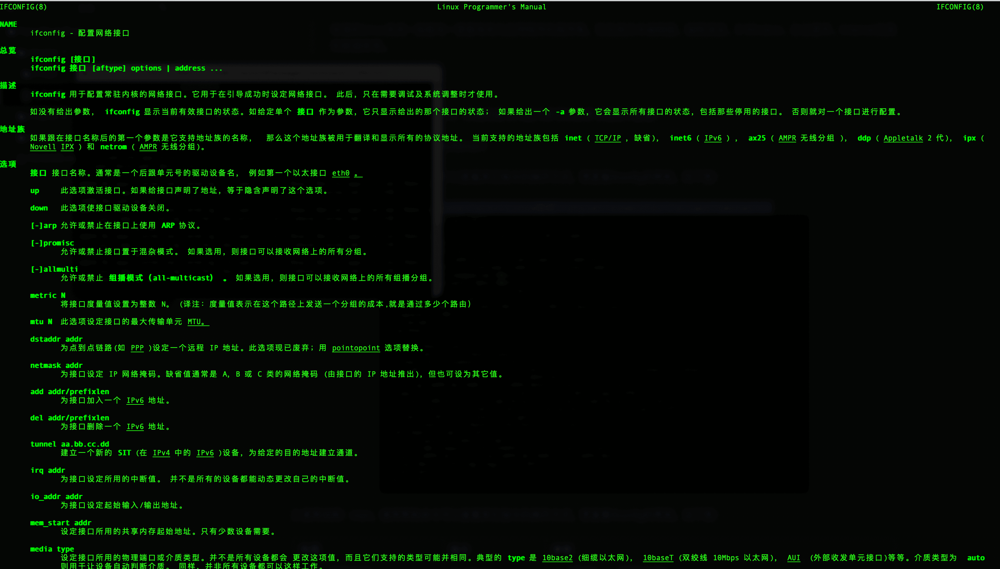

## 本节目录
  \* [准备工作](#准备工作)

  \* [什么是Linux？](#什么是linux)

  \* [Linux主要特性](#linux主要特性)

  \* [Linux系统的组成](#linux系统的组成)

  \* [Linux 常用命令](#linux-常用命令)

   \* [特殊的命令help和man！](#特殊的命令help和man)

   \* [常用命令](\u0023\u5e38\u7528\u547d\u4ee4)

   \* [vi/vim进行文件内容操作](#vivim进行文件内容操作)

## 准备工作

- 一台Linux（虚拟机或者实验楼）
- 静下心来敲一敲

## 什么是Linux？

> Linux，全称GNU/Linux，是一套免费使用和自由传播的类Unix操作系统，是一个基于POSIX的多用户、多任务、支持多线程和多CPU的操作系统 --百度百科

官方介绍如上，那么，通俗说就是：和windows、MacOS一样，Linux是一个操作系统，但他免费且主要用于服务端；

当然，火热的android系统，也是基于Linux内核进行开发的！

在这里，通常Nginx都是部署在Linux服务器上的。

## Linux主要特性

1. 基本思想
2. 完全免费
3. 完全兼容POSIX1.0标准
4. 多用户、多任务
5. 良好的界面
6. 支持多种平台

## Linux系统的组成

1. Linux内核

   > 内核是操作系统的核心，具有很多最基本功能，它负责管理系统的进程、内存、设备驱动程序、文件和网络系统，决定着系统的性能和稳定性。
   >
   > Linux 内核由如下几部分组成：内存管理、进程管理、设备驱动程序、文件系统和网络管理等。如图：

   

2. Linux Shell

   > shell是系统的用户界面，提供了用户与内核进行交互操作的一种接口。它接收用户输入的[命令](https://www.linuxcool.com/)并把它送入内核去执行，是一个[命令](https://www.linuxcool.com/)解释器。另外，shell编程语言具有普通编程语言的很多特点，用这种编程语言编写的shell程序与其他应用程序具有同样的效果。

3. Linux文件系统

   > 和 DOS 等操作系统不同，Linux 操作系统中单独的文件系统并不是由驱动器号或驱动器名称（如 A: 或 C: 等）来标识的。相反，和 UNIX 操作系统一样，Linux 操作系统将独立的文件系统组合成了一个层次化的树形结构，并且由一个单独的实体代表这一文件系统。Linux 将新的文件系统通过一个称为“挂装”或“挂上”的操作将其挂装到某个目录上，从而让不同的文件系统结合成为一个整体。Linux 操作系统的一个重要特点是它支持许多不同类型的文件系统。Linux 中最普遍使用的文件系统是 Ext2，它也是 Linux 土生土长的文件系统。但 Linux 也能够支持 FAT、VFAT、FAT32、MINIX 等不同类型的文件系统，从而可以方便地和其它操作系统交换数据。由于 Linux 支持许多不同的文件系统，并且将它们组织成了一个统一的虚拟文件系统。

4. Linux应用组成

   > 标准的Linux系统一般都有一套都有称为应用程序的程序集，它包括文本编辑器、编程语言、X Window、办公套件、Internet工具和数据库等。

## Linux 常用命令

*这里仅列一些常用的，不会一一列举，详细的指令大全大家可以去参考链接中查看！*

### 特殊的命令help和man！

1.帮助命令：help，使用帮助命令可以查看其它指令的操作方式，想查看ifconfig的帮助，如下图：

2.使用说明：man，如查看ifconfig的说明，如下图：

### 常用命令

| 作用           | 指令     | 参数或使用方法                                             |
| -------------- | -------- | ---------------------------------------------------------- |
| 关机、重启系统 | shutdown | -r （重启）-n（强制关机）                                  |
| 查看目录下内容 | ls       | -a （显示隐藏文件）-l（显示文件详细）                      |
| 切换目录       | cd       | 如 cd .. 回到上一目录，cd ~ 跳到自己home目录               |
| 创建目录       | mkdir    | 如 mkdir ns 则在当前目录下创建一个名为ns的文件夹           |
| 删除           | rm       | -i（删除前询问） -f（强删） -r （删目录及子目录）          |
| 修改           | mv       | -b（若目标存在，覆盖前创建备份） -i （目标存在覆盖前询问） |
| 拷贝           | cp       | -p（修改时间及权限一并复制）-l（生产链接文件）             |
| 搜索           | find     | -cmin -20（过去20分钟内修改的文件）-name (按名称查找)      |
| 创建或修改文件 | touch    | -a （改变读取时间 ）-d （设定日期及时间）                  |

### vi/vim进行文件内容操作

参考链接：

1.[带你认识Linux](https://www.linuxprobe.com/linux-system-structure.html)

2.[菜鸟Linux命令大全](https://www.runoob.com/linux/linux-command-manual.html)

