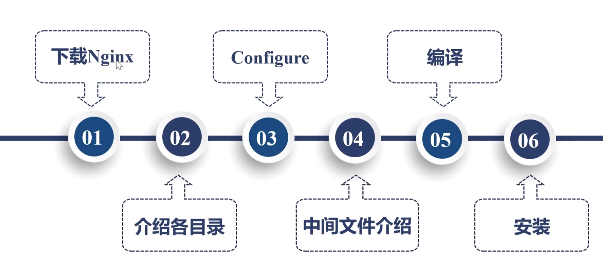

## 开源 NGINX 编译与安装，官方预编译安装，Plus 安装，repo 库管理
### 准备工作

1. 一台Linux虚拟机；
2. 畅通的网络；

### 总体步骤



1. 下载 NGINX;
2. 配置 NGINX;
3. 编译 NGINX;
4. 安装 NGINX;
5. 访问及测试;


### 下载NGINX

1. 访问[NGINX官网](https://nginx.org/en/download.html )选择一个版本，右键【复制链接地址】。
2. 使用weget下载，如下

```shell
wget https://nginx.org/download/nginx-1.18.0.tar.gz
```

### 安装NGINX

1. 使用命令解压

```
tar -xvf nginx-1.18.0.tar.gz
```

2. 进入解压后的文件夹，执行以下命令

```
./configure --prefix=/home/tmp/nginx
```

执行完毕后，目录下会生成objs文件。
